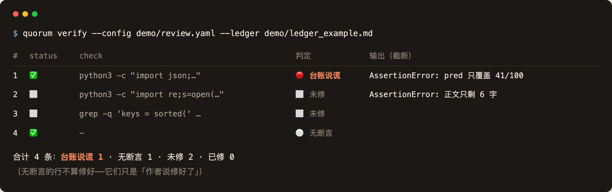

# quorum

**多模型交叉审计引擎：把「AI 说它修好了」变成一条能跑的命令。**

*Multi-model cross-audit — every "I fixed it" becomes a runnable command.*

[](https://github.com/wanqili857-byte/quorum/actions/workflows/ci.yml)




## Highlights

- **每条"修好了"都挂一条能跑的命令** —— `verify` 真跑，判四档；命令跑不过，那句"修好了"就是台账在说谎
- **两个来源轴分开报** —— Model（**声明**，工具验不了）与 Harness（**事实**，从配置推出）。只跨一个方向，两个方向都会骗自己
- **起审核员之前先验通道** —— 发一条**故意写错的凭据**；它还敢回话，就说明请求根本没走它声明的端点
- **不自带模型，也不自带 harness** —— 任何 CLI 走 `exec` 接入，任何 Anthropic 兼容端点都能接；库代码里没有厂商名
- **零密钥可跑** —— 仓库自带 demo：三个审核员是桩，**其中一个是错的**，`plate` 会把它和另外两家对齐在同一簇
- **结论可复现** —— 材料快照指纹进结论头部；结论先写临时文件、四门全过再原子落位

## 30 秒上手（不需要任何 API key）

仓库自带一个 demo，三个「事故」都是真实情节的合成版：

```bash
pip install -e '.[dev]'
python3 demo/project/make.py
quorum run   --config demo/review.yaml --all
quorum plate --config demo/review.yaml
quorum verify --config demo/review.yaml --ledger demo/ledger_example.md
```

demo 里的三个审核员走**桩通道**（打印预设结论），所以整个过程零密钥、零网络。
其中一个审核员的结论是**错的**——`quorum plate` 会把它和其他两家的正确结论对齐在同一簇，
并在明细里逐条列出各家的原话，让你看见「同一处、不同结论」。

## 五条命令

```bash
quorum preflight --config review.yaml --all   # 阴性对照：证明每条通道真打到它声明的端点（能拦人）
quorum run    --config review.yaml --all      # 起独立进程审核（干净上下文，默认全部并发）
quorum plate  --config review.yaml --dispose  # 交叉表：一致 / 独有 · 导出处置台账
quorum verify --config review.yaml            # 跑台账里的断言 → 抓「台账说谎」+ 落事实档案
quorum check-leaks .                          # 泄漏自检（公开仓的守门人）
```

> `run` 起审核员**之前**会自动跑一次 `preflight`。它拦的是这个工具唯一一种
> **在后续任何环节都看不出来**的失败：通道的凭据没生效，请求被路由到了别处，
> 而结论还挂着配置里声明的来源标签。详见下面「凭据没生效」一节。

---

## 为什么需要它

单个模型审自己的同类工作，最大的问题是**它的错你发现不了**。换个模型审能补上——但换了模型之后，
你面对的是一堆自由文本的「发现」，而你没有任何机制判断哪条可信。

真实发生过的一幕：三个审核员里有一个断言「在役权重其实是上一版」，语气肯定、附了命令；
**是另一个审核员用逐字节 `cmp` 把它推翻了**。只用一个审核员，这条假发现就会被当成真的去改。

还有更贵的一幕：**审核员的「✅ 已修」没有人验证**。某一轮复核的全部价值就在于去审上一轮的 ✅，
结果相当一部分站不住。台账越厚，这个缺口越大。

quorum 针对的就是这两件事：**交叉**（谁说的、几家说、两个来源轴各跨了几个）与**可执行断言**
（`check` 列跑不过的 ✅ 就是台账在说谎）。

**但它只堵住了一半，另一半得你自己守**：`check` **跑过了也不等于问题修好了**——
如果那条命令测的是「**你做的那个动作**」而不是「**那个问题**」，它回滚了照样绿。
本项目自己就栽在这上面过一次：审核员找对了问题、给的建议也对，作者把修复降级成缓解，
再用一条只验证「我做了那个动作」的命令打成 ✅。**——当天三轮自审加 `verify` 一处都没报出来，
是用户从工具外面看了一眼配置才发现的。**
细节与自查方法见 [`docs/LESSONS.md`](docs/LESSONS.md)。

### 并发（`--jobs`）

默认**全部并发**：三个审核员就是三个独立进程，不共享临时文件、结论路径与 env，
串行跑只是白等。（`--jobs 1` 强制串行，排查时用。）

并发不是没代价，代价是**归因变粗**：材料在审核期间被改动时，串行能指出是**哪一个**审核员
改的，并发只能说「这一批里有人改了」。换来的是三家审的是**同一份材料的同一时刻**，
而不是先后三份。这笔账会写进结论头部——并发时那句告警明确写「归不到具体某一家」，
不许悄悄退化成串行的措辞。

「独立进程」保证的是**进程之间**不共享状态；**你本机的 hook / skill / MCP 仍会加载**
（手动新开一个会话也是这样，所以这是保真而不是缺陷）。这层边界的完整说明见
[`CONTRACT.md`](CONTRACT.md) 契约一。

## 真实使用

```yaml
# review.yaml
project: my-project
repo: .                       # 相对本文件解析，换 CWD 结果不变
brief: reviews/brief.md       # 工单：自包含，审核员没有前轮记忆
out_dir: reviews/out
ledger: reviews/dispose.md    # 处置台账（verify 读它）
sources: ["src", "data", "reports"]     # 材料快照指纹覆盖这些路径

channels:
  ark:
    kind: claude-cli                        # 任何 Anthropic 兼容端点都能接
    model: <该端点支持的模型名>
    env:
      ANTHROPIC_BASE_URL: https://<你的端点>
      ANTHROPIC_AUTH_TOKEN_FILE: ~/.config/<密钥文件>   # 密钥只给路径，内容不进配置
  codex:
    kind: codex-cli                         # 只认 responses 协议；只给 chat/completions 的端点接不了
  opencode:
    kind: opencode-cli                      # 官方 opencode harness：自带协议适配
    model: <provider>/<模型名>
    env:
      ARK_KEY_FILE: ~/.config/<密钥文件>
      OPENCODE_CONFIG_CONTENT: |
        {"provider": {"<provider>": {"npm": "@ai-sdk/openai-compatible",
          "options": {"baseURL": "https://<端点>/v1", "apiKey": "{env:ARK_KEY}"},
          "models": {"<模型名>": {}}}}}
  any-cli:
    kind: exec                              # 任何别的 CLI，不用改库源码
    harness: my-agent                       # exec 必须自己起 harness 名
    argv: ["my-agent", "--read-only", "-C", "{repo}", "-p", "{prompt}"]

reviewers:
  - {name: a, channel: ark,      vendor: <模型来源A>, role: primary}
  - {name: b, channel: opencode, vendor: <模型来源B>, role: primary}
  - {name: c, channel: codex,    vendor: <模型来源C>, role: cross}
```

### 两条来源轴，别把它们混成一个

交叉审计的价值来自**失效模式独立**。而独立有两种，是**两件事**：

| 轴 | 是什么 | 性质 | 不同意味着 |
|---|---|---|---|
| `vendor` | **模型来源**：谁训的权重 | **声明**（工具验证不了） | 训练数据/偏见的盲区不同 |
| `harness` | **agent 框架**：哪个 CLI 在跑它 | **事实**（从 channel 推出） | 怎么读材料、怎么找证据、怎么下结论不同 |

**只跨一个轴是不够的**，两个方向都会骗到自己：

- 两个 vendor 走**同一个 harness** → 它们的共识可能来自那套 loop（同一 system prompt、
  同一工具、同一种「读文件—找证据—列表格」的套路），不是来自两个独立模型。
- 同一个 vendor 换 harness → 换外壳不换模型，**盲区还是共享的**。

所以 `plate` 两个轴都报，并在表头注记：

```
> ⚠️ primary 的 vendor 不同，但全走同一个 harness（`claude-cli`）——
>   它们的一致可能来自 harness，而非来自两个独立模型。
```

注记**不降级**——模型层的独立是真的，抹掉是过度惩罚。它只是告诉你这次的一致性值多少。

`vendor` 是 COI 规则的载体：**同一 vendor 不能有两个 primary**（同源模型看不出同源的盲区），
配置违反会直接报错。

### 凭据没生效：唯一一种「事后看不出来」的失败

上面那张表里，`vendor` 那一栏写着**声明**——工具验证不了。这句话曾经只是句话，
直到它真的发生了：

> 四条通道声明了四个厂商的模型。**连续四轮复核，请求全部由同一个模型服务。**
> 根因是 CLI 读了自己的用户级 settings，`env` 段盖过了 runner 传进去的进程环境变量，
> 于是配置里那几个 `ANTHROPIC_BASE_URL` / `ANTHROPIC_AUTH_TOKEN` **一次都没生效**。
> 台账里每一行都写着「跨模型族一致 · 高置信」。
>
> 四轮没有一轮审出来——**因为「审核员是谁」这件事根本不在于审核员的视野里**，
> 它写在审核员读不到的配置里。审核员的输出、结论、证据全部自洽，他们只是不知道自己是谁。

所以 `run` 起审核员之前会先跑一次 `quorum preflight`，每条通道发两次极小的请求：

| | 怎么发 | 期望 |
|---|---|---|
| **阳性对照** | 真凭据 | **必须**回话，否则这条通道是死的，预检对它无从判断 |
| **阴性对照** | 同样的 argv、同样的端点，**只把凭据换成故意错的** | **不许**回话 |

阴性那条是关键：**「拿错凭据也照样回话」对正确的实现是不可能发生的**，
所以它不是启发式，是一条能红的断言。而它恰好精确命中上面那种症状。
只有阴性是不够的——真实 CLI 拿到坏凭据未必报错，可能只是**挂住**，
那样「没成功」就同时对应「被拒」和「通道是死的」，两者混成同一档。

**它证明什么、不证明什么**（别读大）：

- 证得了：这一路请求确实经过了它声明的那个端点（凭据在那里被校验）。
- 证不了：**模型是谁**。

所以还有**第二条轴**：再发一次极小请求，读**应答里带的模型名**，和声明的比对。
它抓的是**别名映射**——第三方端点普遍有一层，声明 `glm-5.3-pro` 回来的可能是 `glm-5.3`。
也就是说你以为买的档位和实际拿到的可能不是一回事，而这件事在结论里完全看不出来。

**第二条轴会做归一化，否则全是假警报**：`glm-5.3-flash` → `glm-5-3-flash`（点转横线）、
`-260915` 这类日期后缀被剥——都不是换模型。一条每次都响的警报会被学会无视。

`mismatch` **不拦人**（那是配置选择问题）；拦人只留给 `hijacked`——
**没有别的检测手段**的那一种。判不了的档（`no_credential` / `channel_down` /
`egress_blocked` / 端点藏在 CLI 自己注册表里的 `unverifiable`）也都不拦，但报告会明说
「这次没验过」——「没查到问题」和「没查」在输出里必须长得不一样。

### 网络出口：第二种「事后看不出来」的失败

`channel_down` 曾经把**四种现实**压成一档：凭据错 / 端点错 / CLI 没装 / **出口不通**。
前两种换个凭据还能逼近，第三种直接看得见，**第四种此前没有任何检测手段**——
而它是最常见的一类：代理没起、代理地址写错、主机被丢包、DNS 不通。

所以阳性对照失败之后，会再跑一次**可达性探针**，然后分开报：

| 探针结果 | 档位 | 说明 |
|---|---|---|
| 端点的 TCP:443 连不上 | **`egress_blocked`** | 病因是网络，不是这条通道 |
| 连得上，但通道仍然没回话 | `channel_down` | 病在这条通道本身 |

**探针必须和被测 CLI「同样瞎」，这是要害。** 它只用**子进程真正拿到的**代理变量
（`os.environ` 叠加通道 env 之后的结果），不掺 quorum 自己的偏好，也不走 `urllib`
的隐式代理发现。**探针比被测对象聪明的那一刻，它证明的东西就没了。** 所以底下是
裸 socket，不是 HTTP 请求——裸 GET 打基地址时服务器可能只是**不回话**（而非拒绝），
而「哪个路径算活着」本身就是猜。

**它抓不到什么，别读大**：上面那次事故里 `opencode.ai` 的 TCP **是通的**，
封锁发生在应用层——那是 L1（把子进程的理由带出来）的活，不是这一档的。

#### 为什么这件事反复发生：系统代理对 CLI 不可见

本机（以及绝大多数 macOS + 代理客户端）的代理配在**系统代理**里，而
**CLI 不读系统代理，只认环境变量**——Node、`git`、任何 Unix 程序都一样。

```
scutil --proxy        →  HTTPSProxy 127.0.0.1:7897   ← 有
env | grep -i proxy   →                             ← 空
```

于是症状是**「curl 通、工具不通」**：`curl` 恰好读系统代理，所以它正常，
而真正要干活的 CLI 直连出去被丢包。**报错文本还会指向错误的方向**——
`Failed to connect to ... Couldn't connect to server` 看起来像网络断了，
其实是「代理没被用上」。

**修法**：把 `HTTPS_PROXY` / `HTTP_PROXY`（含 `NO_PROXY=127.0.0.1,localhost`）
写进**通道的 env**，不要只靠 shell export。写进配置的理由和别处一样——
配置是审计来源的唯一凭据，它会出现在 `--dry-run` 与快照里；shell export 的话
「这一轮走的是哪个出口」事后无从追查。**只给出境通道加**：国内端点走代理反而可能出问题。

那一层故意**不拦人**，理由和别的「判不了」档一样：探针可能误报（被测 CLI 也许有
探针没有的网络能力），而**可能误报的闸门迟早会被关掉**。它的价值在于**说清病因**。

### 模型和 harness 都是你自己接的

**quorum 不自带任何模型，也不自带任何 harness。** `kind` 描述的是「怎么起一个进程」——
`claude-cli` / `codex-cli` / `opencode-cli` 是三种内置起法，`exec` 是通用入口（自己写 argv，
接任何 CLI），`fake` 是测试桩。底下跑谁的模型、用哪个 agent CLI，由**你的配置**决定，
工具不解释也不验证。

内置三种起法覆盖的**协议面**不同，选哪个由你的端点决定：

| 起法 | 能吃 |
|---|---|
| `claude-cli` | 任何 Anthropic 兼容端点 |
| `codex-cli` | 只认 `responses`；**只给 chat/completions 的端点接不了** |
| `opencode-cli` | 自带协议适配，**编码套餐那种只给 chat/completions 的端点也能接** |

最后一行是为什么要内置三种而不是两种：很多**订阅制编码套餐**只开 chat/completions，
于是「全用订阅跑」和「harness 那一轴也跨开」会变成二选一——而那是个假两难，
补一个自带适配的 harness 就同时成立。

库代码里没有任何厂商名；上面的 `<模型来源A>` 与 README 里出现的例子都只是例子，不是选项全集。
详见 [`examples/`](examples/)。

## 五条契约

引擎一千多行（`wc -l quorum/*.py` 现算），读到这儿你大概已经能猜到它长什么样——**真正起作用的是下面这五条契约**：
它们写死在 `CONTRACT.md` 里，也写死在模板里。

| 契约 | 约束什么 |
|---|---|
| **配置** | 一个 `review.yaml` 描述「审什么、谁来审、门禁多严」。**引擎里不出现任何具体项目的信息** |
| **工单** | 自包含、**按「声明」而不是「文件」组织**、必须留一节让审核员反驳作者的方法学结论 |
| **通道** | 通道声明的端点必须被**事实侧**核对过（`preflight` 的阳性 + 阴性对照）。**声明不算数** |
| **输出** | 严重度表（每条带「我怎么查出来的」）+ 最脆弱一环 + 附录「推翻了什么」 |
| **处置** | 台账每行可挂一条 `check` 断言；`verify` 跑它，并把判出的 🔴 落成**事实档案**（见下） |

## 台账说谎记录：事实自动落盘，判断留给人

`verify` 判出 🔴 时，会把这一条**自动**写进一份档案（配置里的 `incidents`；不配就不写）。

它和 `docs/LESSONS.md` **不是一回事，别混**：

| | `docs/LESSONS.md` | 台账说谎记录 |
|---|---|---|
| 是什么 | **判断** —— 这条事故是什么、叫什么、跟哪条旧教训同类 | **事实** —— 哪一行、哪条命令、真实输出、材料快照 |
| 谁写 | **人** | **机器** |

分这条线是因为：**机器负责「一定会留痕」，人负责「这条算不算一件事」。** 让机器去生成"教训"，
产出的是没人读的填充物，反而把真教训埋了。

两条规矩：

- **同一条反复红不追加新行**，只更新「最近」和「次数」—— 否则档案会变成流水账，
  而假警报淹没真警报比少一条记录更糟。
- **行号不参与标识**（只作显示并随台账刷新）：台账中间插一行会让下面的行号整体漂移，
  行号若算进标识，去重当场失效。

只记 `LIE`。`error`（命令根本没跑起来：超时、环境缺工具）**默认不记** ——
它常属于「门禁的结果取决于跑它的机器」那一类，混进来会淹掉真事故。
要记就显式开 `--incidents-include-error`。

⚠️ 写档案失败**不改变 `verify` 的退出码**：没留痕 ≠ 台账有了新结论。
（同「内容优先于退出码」。）CI 里建议 `--no-incidents` —— 那边写的档案没人看。

## 泄漏自检：退出码不等于「干净」

```bash
quorum check-leaks .
```

**规则分两档，只有 `fail` 档决定退出码：**

| 档 | 是什么 | 退出码 |
|---|---|---|
| `fail` | **确定性**形状：凭证、私钥、邮箱、路径里出现本机用户名 | 非零 |
| `warn` | **启发式**：`~/<任意词>/` 这类。没有语法办法区分「人名」和「目录名」 | 不影响 |

所以 **`rc=0` 只意味着「没有 `fail` 档命中」**——`warn` 档里完全可能躺着真泄漏。
提示行会标「（提示，不判定失败）」，**必须读输出正文，别只看退出码**。

为什么这么切：扫一个真实仓库时，`~/<任意词>/` 把 `~/workspace/`、`~/bench-runs/`
这类**正当占位符**判成了泄漏。**假警报淹没真警报，比少一条规则更糟**——你会先学会无视它。
但也不能干脆删掉这条规则：人名目录混在里面时它是唯一的线索。降档是唯一诚实的做法。

`--self-test` 会给每条规则**种一个样本**并断言它能被抓到——**自检本身必须能失败**。


- **不是「多跑几个模型」的包装。** 价值在交叉与可证伪，不在并发。单个模型 + 人审在很多场景更划算。
- **不保证审核员是对的。** 交叉能提高信噪比，不能消除错误。`plate` 的输出里「单家独有」**必须人工复验**。
- **不是自动化裁判。** 它给你一张对齐好的表和一套可跑的断言，判断仍然是你的。
- **什么时候不该用**：材料里没有**可复算的事实源**时，多模型只会互相抄——先让材料可复算，再谈交叉审计。

## 设计上刻意做的选择

- **只走 CLI，不提供 import API。** 需要编程接入就消费 `quorum plate --json`（稳定的输出契约），
  这样上层不必跟版本绑定，非 Python 项目也能用。也不做 MCP——那只是给 CLI 套一层生命周期。
- **审核员只读、结论由 runner 落盘。** 结论由 runner 写，审核员进程不碰材料。
  注意：`codex-cli` 能在 CLI 层**强制**只读（`-s read-only`），`claude-cli` / `opencode-cli` 不能——
  后两者只能靠工单措辞 + **事后材料快照比对**兜底。`run` 会把只读强度打印出来并记进结论头部，
  不让「审核员只读」变成一个没人验证的假设。
- **「声明」必须配一条事实侧的对照。** 通道报的 `vendor` 工具验不了，这是事实；
  但**验不了不等于不去验能验的那部分**。`preflight` 用一条故意错的凭据反证
  「请求确实经过了它声明的端点」——这是唯一一种事后看不出来的失败，所以值得为它多花两次请求。
- **内容优先于退出码。** 退出码描述的是进程，不是材料。完整结论不该因为收尾信号被作废。
- **材料快照指纹进结论头部。** 「这份结论审的是哪一版」必须能被回答；各家快照不一致时 `plate` 直接报警。
- **结论先写临时文件、四门全过再原子落位**，已有非空结论先留档——损坏一份已有结论比不产出更糟。

## 这个仓库自己就是一次用例

quorum 被它自己审过三轮 —— 40+ 条发现，逐条处置。
这不是营销话术，材料和台账都在仓库里：

> ⚠️ **但那三轮的「三个通道」是假的（2026-10-02 更正）。**
> 配置里写着 kimi / qwen / codex 三个来源，**实际三条全部由同一个模型服务**：
> 两个 `claude-cli` 通道声明的 `ANTHROPIC_*` 环境变量从未生效（进程环境变量被 CLI 自己的
> 用户级 settings 盖过），请求被送进本机代理，由它按自己的 provider 路由。
> codex 那条没有被劫持，**所以真实的形状是「1 个 vendor × 2 个 harness」**，不是三个独立来源。
>
> **发现本身保留**——它们是关于代码的，逐条对着源码核过，作废的只是**置信度**那一列。
> 原委与证据见 [`reviews/CORRECTIONS.md`](reviews/CORRECTIONS.md)。
>
> 这件事直接催生了 `quorum preflight`：工具现在会在起审核员之前，
> 用一条**故意错的凭据**反证「请求真的经过了配置里声明的那个端点」。

| 位置 | 是什么 |
|---|---|
| `reviews/brief.md` | 自审工单（按「声明」组织，不是按文件） |
| `reviews/review.yaml` | 通道配置（**原始的「三个模型族」标注已作废**，见上） |
| `reviews/rounds/` | 三轮的原始结论 + 交叉表（含一件缺件的如实说明） |
| `reviews/dispose.md` | 处置台账，**24 条带可执行断言** |

跑一下：

```bash
quorum verify --config reviews/review.yaml     # 24 条断言，全部会真跑
```

三轮里抓到的都是「作者看不见自己」的那一类，摘三条最有代表性的：

- `plate --dispose` 是裸 `open(path,"w")`，而默认路径正好是**用户填好的台账**——
  同一个写法就写在 `docs/LESSONS.md` 的「事故二」里，作者写了教训却没检查自己的代码。
- `check-leaks --self-test` 的过滤条件恰好滤掉了它要抓的失败
  （失败消息含「样本」，而代码写的是 `if "样本" not in f`）——
  **「检查能不能失败」的检查，自己不能失败**。
- `CONTRACT.md` 写着「cross 的结论不计入跨模型族一致」，而 `role` 在两个模块里**从未被读取**。

## 文档

- [`CONTRACT.md`](CONTRACT.md) —— 四条契约的正典（想接进自己流程，读这份）
- [`docs/LESSONS.md`](docs/LESSONS.md) —— 每条硬规则背后的**真实事故**
- [`demo/README.md`](demo/README.md) —— 三个事故的说明

## 许可

MIT
